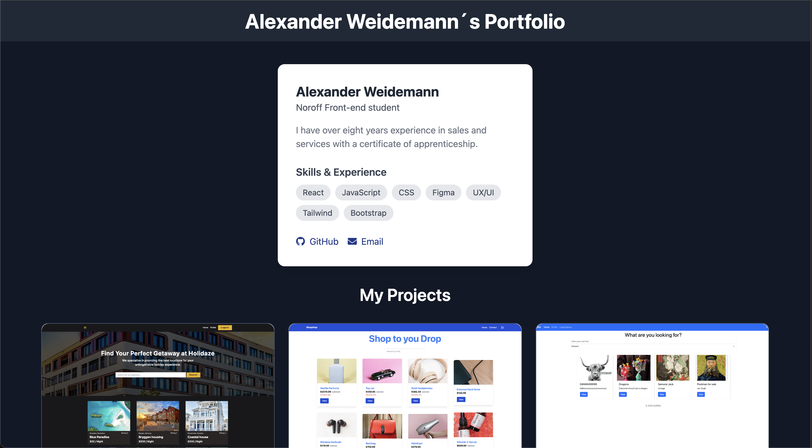

# Portfolio 2

This is my delivery on Front-end Frameworks where you can add to cart and make a purchase.

## Assignement

Document three prior submissions from the first year:
Semester Project 2
JavaScript Frameworks CA
Project Exam 2

### Points

List the 3 projects as cards and each card must have:

- the title of the project,
- a description,
- a screenshot of how the project looks when running,
- a link to the GitHub repo and a live site if it is online.

## Built With

- React
- Vite
- Tailwind

## Contact

[My Github](https://github.com/Zaracki)
